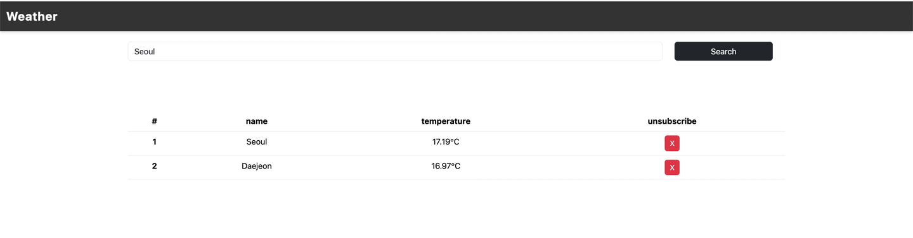

# Weather Web Application

## 소개

이 프로젝트는 **Spring Framework** 기반으로 개발된 웹 애플리케이션으로, 사용자가 여러 도시를 추가하고 해당 도시들의 현재 온도를 실시간으로 모니터링할 수 있는 기능을 제공합니다.

## 기능

- **도시 추가**: 사용자는 모니터링할 도시를 여러 개 추가할 수 있습니다.
- **현재 날씨 조회**: 추가된 도시의 현재 온도를 확인할 수 있습니다.
- **도시 목록 관리**: 추가된 도시 목록을 손쉽게 관리할 수 있습니다.

## 기술 스택

- **백엔드**
    - Java 17
    - Spring Boot 3.2
    - Spring Websocket 3.2
    - Spring WebFlux 3.2
    - Caffeine Cache 3.1
    - Gradle
- **프론트엔드**
    - Thymeleaf, HTML, CSS, JavaScript
- **API**
    - [OpenWeather](https://openweathermap.org/)

